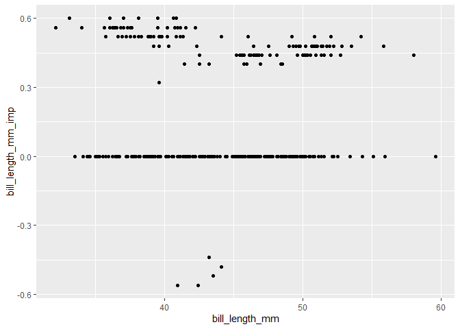
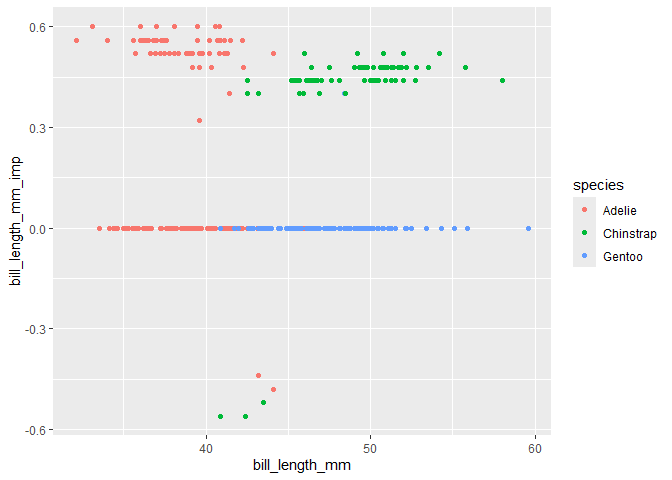
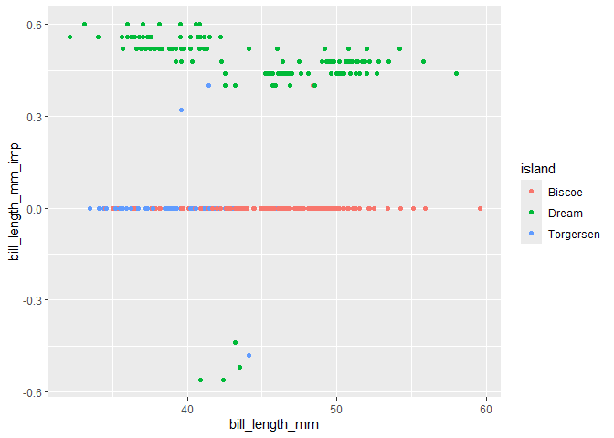
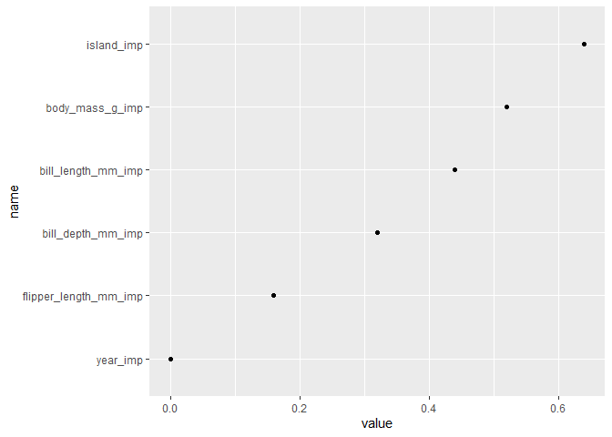
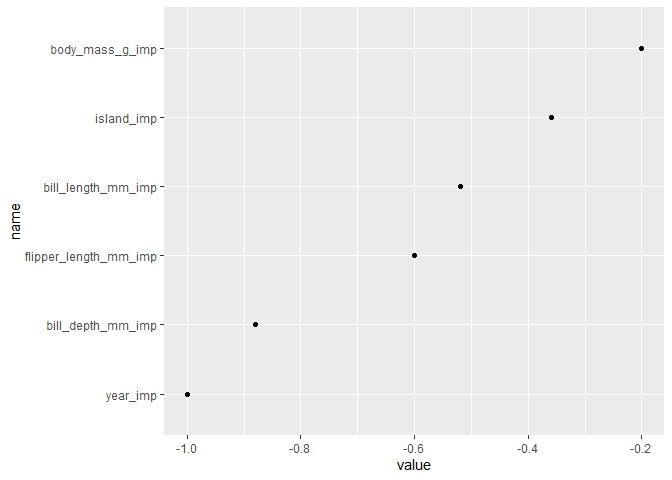
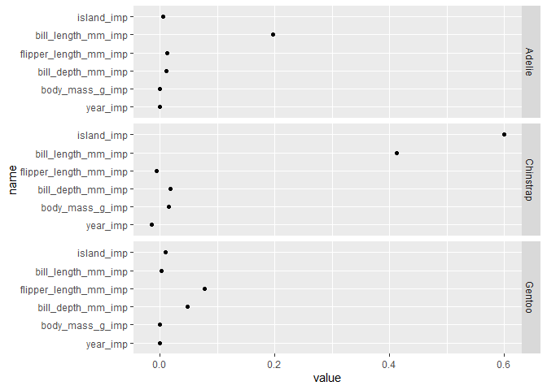
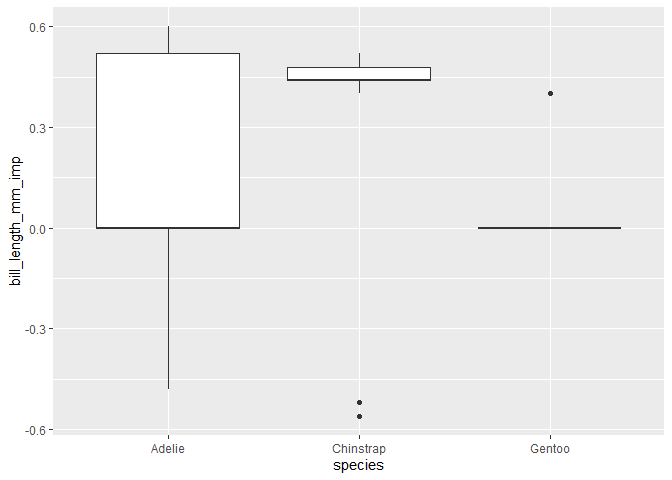

<!-- README.md is generated from README.Rmd. Please edit that file -->

# CLIQUE

<!-- badges: start -->

[](https://github.com/KelvynBladen/CLIQUE/actions/workflows/R-CMD-check.yaml)
<!-- badges: end -->

The goal of CLIQUE is to compute local variable importance values for a
dataset, conditioned on a model.

## Installation

You can install the development version of CLIQUE from
[GitHub](https://github.com/) with:

``` r
# install.packages("pak")
pak::pak("KelvynBladen/CLIQUE")
```

## Example

This is a basic workflow which shows how to implement clique and derive
meaningful insights from the resulting importance values:

``` r
library(CLIQUE)
library(palmerpenguins)
library(tidyverse)
```

``` r
penguins = palmerpenguins::penguins |> filter(!is.na(bill_length_mm)) |>
  select(!sex)
```

``` r
v <- clique(formula = factor(species) ~ ., data = penguins,
            method = "rf", cores = 2, parallel = F)

temp = v$local_imp
colnames(temp) = paste0(colnames(temp), "_imp")
df = data.frame(penguins, temp)
```

``` r
ggplot(df, aes(x = bill_length_mm, y = bill_length_mm_imp)) +
  geom_point()
```



``` r

ggplot(df, aes(x = bill_length_mm, y = bill_length_mm_imp, colour = species)) +
  geom_point()
```



``` r

ggplot(df, aes(x = bill_length_mm, y = bill_length_mm_imp, colour = island)) +
  geom_point()
```



``` r
t329 = temp[329, ] |> pivot_longer(cols = everything()) |>
  arrange(desc(value))

t329$name <- factor(t329$name, levels = rev(t329$name))

ggplot(t329, aes(x = value, y = name)) + geom_point()
```



``` r
t339 = temp[339, ] |> pivot_longer(cols = everything()) |>
  arrange(desc(value))

t339$name <- factor(t339$name, levels = rev(t339$name))

ggplot(t339, aes(x = value, y = name)) + geom_point()
```



``` r
temp$species = penguins$species

ta = temp |> group_by(species) |> 
  summarise(across(where(is.numeric), \(x) mean(x))) |>
  pivot_longer(cols = 2:7) |> arrange(desc(value))
ta$name <- factor(ta$name, levels = rev(unique(ta$name)))

ggplot(ta, aes(x = value, y = name)) + geom_point() +
  ggh4x::facet_wrap2(~species, dir = "v", strip.position = "right")
```



``` r

ggplot(temp, aes(x = species, y = bill_length_mm_imp)) +
  geom_boxplot()
```


